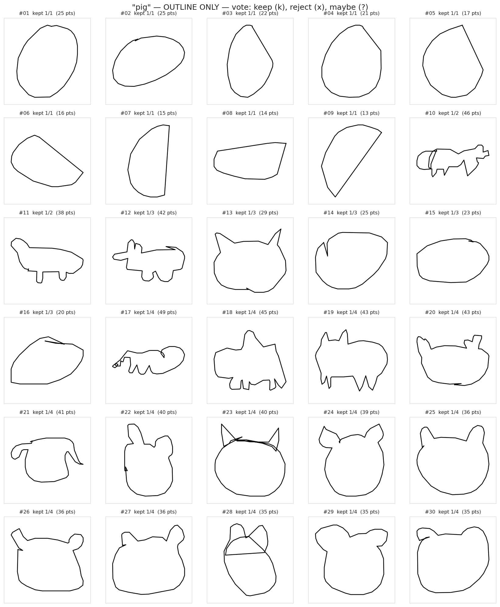
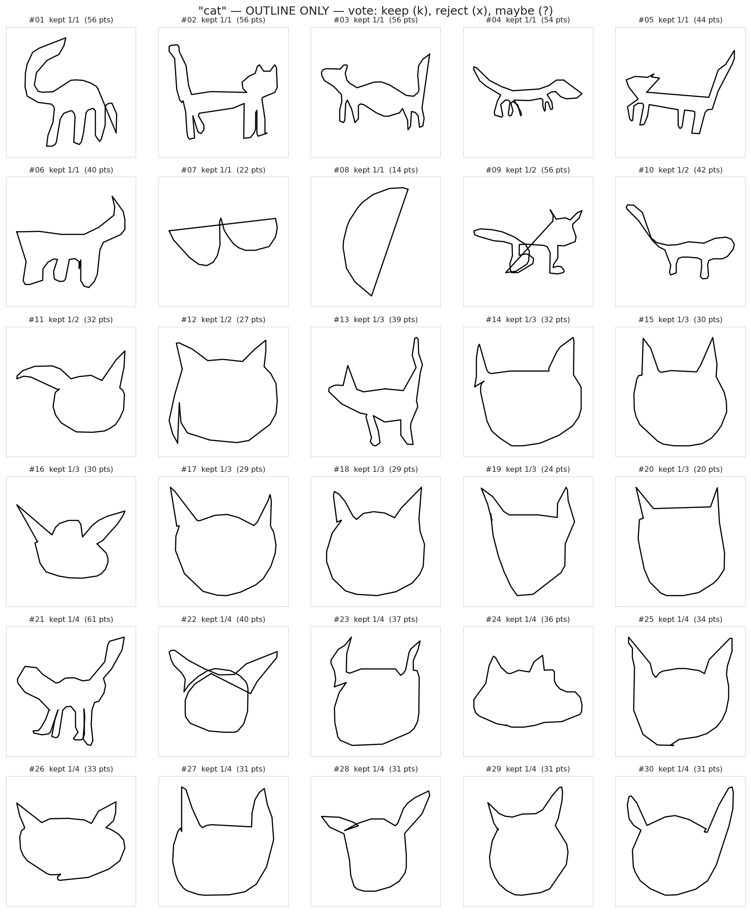
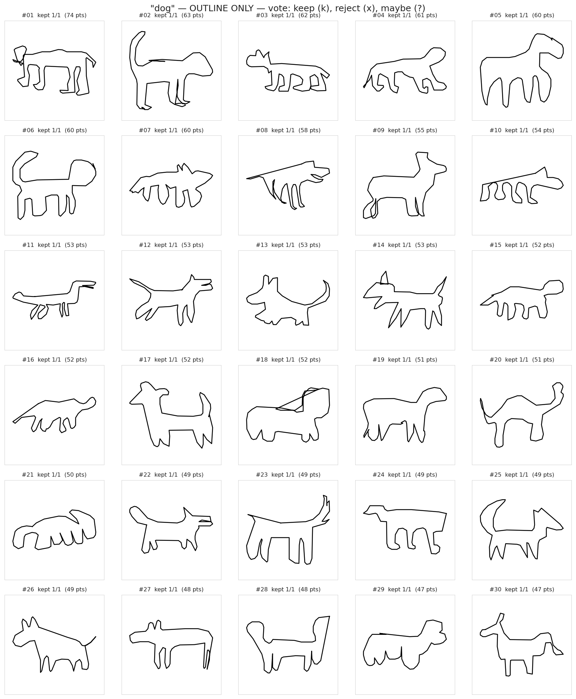
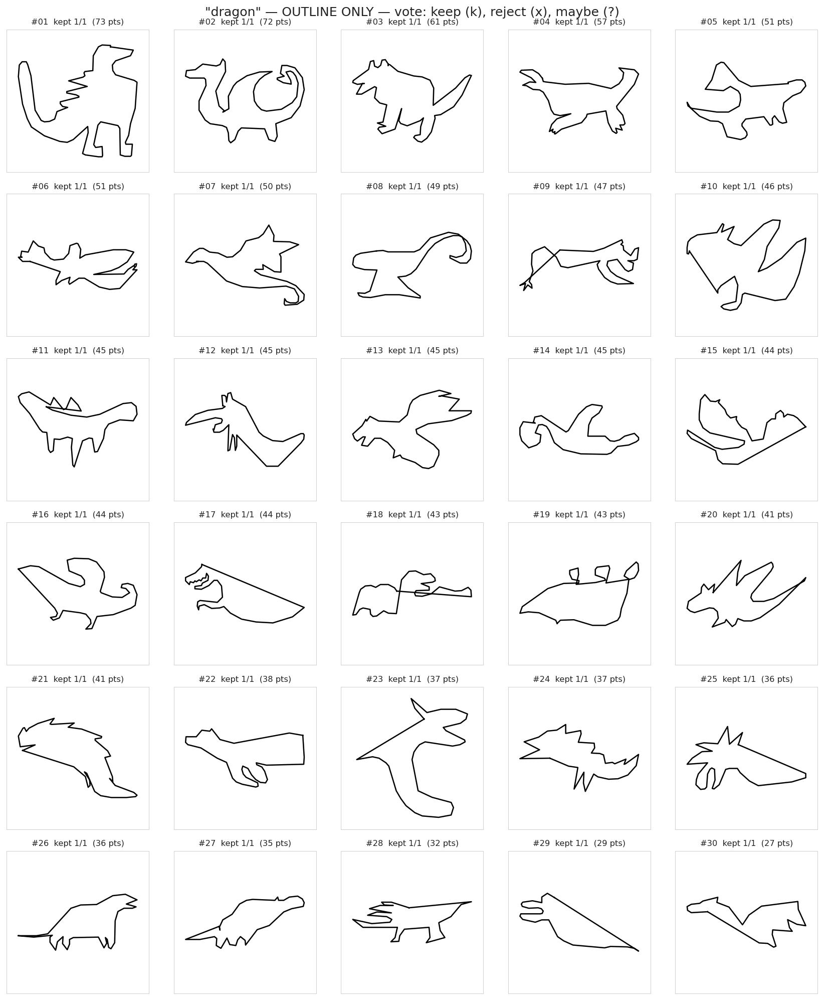
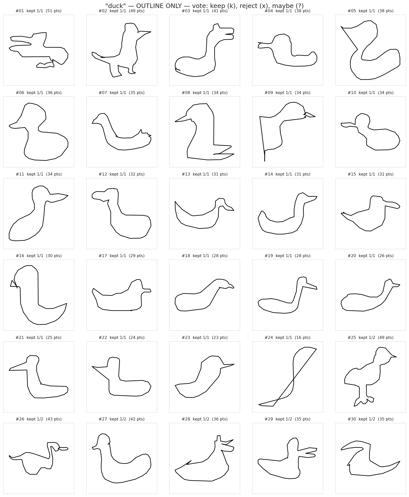

# Quick Draw template vote sheet

Mark each `keep`/`reject`/`?` next to the template number.
Reference image is in `data/previews/voting/<animal>_grid.png`.

## pig

| # | kept/orig strokes | pts | key_id | vote |
|---|---|---|---|---|
| 01 | 1/1 | 25 | `5734348785451008` | _ |
| 02 | 1/1 | 25 | `5959084475940864` | _ |
| 03 | 1/1 | 22 | `6654828795133952` | _ |
| 04 | 1/1 | 21 | `5301402433748992` | _ |
| 05 | 1/1 | 17 | `4697412754997248` | _ |
| 06 | 1/1 | 16 | `5700355297902592` | _ |
| 07 | 1/1 | 15 | `4915464117420032` | _ |
| 08 | 1/1 | 14 | `6523357879074816` | _ |
| 09 | 1/1 | 13 | `5512014673739776` | _ |
| 10 | 1/2 | 46 | `6349167049834496` | _ |
| 11 | 1/2 | 38 | `6233025362788352` | _ |
| 12 | 1/3 | 42 | `6429791903285248` | _ |
| 13 | 1/3 | 29 | `6711342218084352` | _ |
| 14 | 1/3 | 25 | `5806843337113600` | _ |
| 15 | 1/3 | 23 | `5089921930887168` | _ |
| 16 | 1/3 | 20 | `6456316929245184` | _ |
| 17 | 1/4 | 49 | `6697195325620224` | _ |
| 18 | 1/4 | 45 | `5893516913803264` | _ |
| 19 | 1/4 | 43 | `4600478774067200` | _ |
| 20 | 1/4 | 43 | `4664332623282176` | _ |
| 21 | 1/4 | 41 | `5516610666233856` | _ |
| 22 | 1/4 | 40 | `5598210582118400` | _ |
| 23 | 1/4 | 40 | `5100791582949376` | _ |
| 24 | 1/4 | 39 | `5406192585146368` | _ |
| 25 | 1/4 | 36 | `4926861689749504` | _ |
| 26 | 1/4 | 36 | `6020334085996544` | _ |
| 27 | 1/4 | 36 | `5650027743543296` | _ |
| 28 | 1/4 | 35 | `5202838126854144` | _ |
| 29 | 1/4 | 35 | `5193262564376576` | _ |
| 30 | 1/4 | 35 | `6059012250402816` | _ |

## cat

| # | kept/orig strokes | pts | key_id | vote |
|---|---|---|---|---|
| 01 | 1/1 | 56 | `5627759021785088` | _ |
| 02 | 1/1 | 56 | `6016825164824576` | _ |
| 03 | 1/1 | 56 | `5647014836568064` | _ |
| 04 | 1/1 | 54 | `4951575292280832` | _ |
| 05 | 1/1 | 44 | `5313347471802368` | _ |
| 06 | 1/1 | 40 | `4939591528218624` | _ |
| 07 | 1/1 | 22 | `5236975952986112` | _ |
| 08 | 1/1 | 14 | `5079326208819200` | _ |
| 09 | 1/2 | 56 | `5270944601866240` | _ |
| 10 | 1/2 | 42 | `6647701166882816` | _ |
| 11 | 1/2 | 32 | `5795667328892928` | _ |
| 12 | 1/2 | 27 | `6117278204559360` | _ |
| 13 | 1/3 | 39 | `5706494718771200` | _ |
| 14 | 1/3 | 32 | `4645228948488192` | _ |
| 15 | 1/3 | 30 | `6008423885832192` | _ |
| 16 | 1/3 | 30 | `6578320734945280` | _ |
| 17 | 1/3 | 29 | `6252830811750400` | _ |
| 18 | 1/3 | 29 | `5447449000804352` | _ |
| 19 | 1/3 | 24 | `6072539614806016` | _ |
| 20 | 1/3 | 20 | `5900783738421248` | _ |
| 21 | 1/4 | 61 | `5152391471038464` | _ |
| 22 | 1/4 | 40 | `4749313576009728` | _ |
| 23 | 1/4 | 37 | `5433073153867776` | _ |
| 24 | 1/4 | 36 | `5931097160417280` | _ |
| 25 | 1/4 | 34 | `4630035333906432` | _ |
| 26 | 1/4 | 33 | `6557807245524992` | _ |
| 27 | 1/4 | 31 | `4596581552619520` | _ |
| 28 | 1/4 | 31 | `5175643870330880` | _ |
| 29 | 1/4 | 31 | `5336018351816704` | _ |
| 30 | 1/4 | 31 | `5918055693549568` | _ |

## dog

| # | kept/orig strokes | pts | key_id | vote |
|---|---|---|---|---|
| 01 | 1/1 | 74 | `6590363819048960` | _ |
| 02 | 1/1 | 63 | `6596577026113536` | _ |
| 03 | 1/1 | 62 | `5379817425862656` | _ |
| 04 | 1/1 | 61 | `6018250569678848` | _ |
| 05 | 1/1 | 60 | `6376888459067392` | _ |
| 06 | 1/1 | 60 | `4546536698544128` | _ |
| 07 | 1/1 | 60 | `5989342285660160` | _ |
| 08 | 1/1 | 58 | `5741849828392960` | _ |
| 09 | 1/1 | 55 | `6117507855286272` | _ |
| 10 | 1/1 | 54 | `6434936049369088` | _ |
| 11 | 1/1 | 53 | `4521441850556416` | _ |
| 12 | 1/1 | 53 | `5885461807497216` | _ |
| 13 | 1/1 | 53 | `5689744325345280` | _ |
| 14 | 1/1 | 53 | `5006833670422528` | _ |
| 15 | 1/1 | 52 | `4980842210263040` | _ |
| 16 | 1/1 | 52 | `4866087294337024` | _ |
| 17 | 1/1 | 52 | `4703797840445440` | _ |
| 18 | 1/1 | 52 | `6076327973093376` | _ |
| 19 | 1/1 | 51 | `5567488232259584` | _ |
| 20 | 1/1 | 51 | `6687738059292672` | _ |
| 21 | 1/1 | 50 | `6175602182717440` | _ |
| 22 | 1/1 | 49 | `6625773827915776` | _ |
| 23 | 1/1 | 49 | `5425161555673088` | _ |
| 24 | 1/1 | 49 | `6614673820483584` | _ |
| 25 | 1/1 | 49 | `6542044736520192` | _ |
| 26 | 1/1 | 49 | `6061723926659072` | _ |
| 27 | 1/1 | 48 | `5355682876358656` | _ |
| 28 | 1/1 | 48 | `6247060489633792` | _ |
| 29 | 1/1 | 47 | `6506345735913472` | _ |
| 30 | 1/1 | 47 | `5506317613531136` | _ |

## dragon

| # | kept/orig strokes | pts | key_id | vote |
|---|---|---|---|---|
| 01 | 1/1 | 73 | `5361561528958976` | _ |
| 02 | 1/1 | 72 | `5426461102047232` | _ |
| 03 | 1/1 | 61 | `5111665752276992` | _ |
| 04 | 1/1 | 57 | `4701967311962112` | _ |
| 05 | 1/1 | 51 | `4670553904381952` | _ |
| 06 | 1/1 | 51 | `5433337315328000` | _ |
| 07 | 1/1 | 50 | `5724506045808640` | _ |
| 08 | 1/1 | 49 | `5014671151071232` | _ |
| 09 | 1/1 | 47 | `6328632790220800` | _ |
| 10 | 1/1 | 46 | `6195574120382464` | _ |
| 11 | 1/1 | 45 | `5808433934630912` | _ |
| 12 | 1/1 | 45 | `5490027897290752` | _ |
| 13 | 1/1 | 45 | `4793838910570496` | _ |
| 14 | 1/1 | 45 | `6453311144198144` | _ |
| 15 | 1/1 | 44 | `5023343226912768` | _ |
| 16 | 1/1 | 44 | `5146296979554304` | _ |
| 17 | 1/1 | 44 | `6178141552771072` | _ |
| 18 | 1/1 | 43 | `5490062974255104` | _ |
| 19 | 1/1 | 43 | `6453090460893184` | _ |
| 20 | 1/1 | 41 | `6671931791114240` | _ |
| 21 | 1/1 | 41 | `6226655133564928` | _ |
| 22 | 1/1 | 38 | `5367711720800256` | _ |
| 23 | 1/1 | 37 | `6054441562144768` | _ |
| 24 | 1/1 | 37 | `6289649607639040` | _ |
| 25 | 1/1 | 36 | `6420998511394816` | _ |
| 26 | 1/1 | 36 | `6471394504212480` | _ |
| 27 | 1/1 | 35 | `5395559600881664` | _ |
| 28 | 1/1 | 32 | `6459270344212480` | _ |
| 29 | 1/1 | 29 | `4671599661809664` | _ |
| 30 | 1/1 | 27 | `4689451362025472` | _ |

## duck

| # | kept/orig strokes | pts | key_id | vote |
|---|---|---|---|---|
| 01 | 1/1 | 51 | `6519930449035264` | _ |
| 02 | 1/1 | 49 | `4953854862950400` | _ |
| 03 | 1/1 | 41 | `5962443090034688` | _ |
| 04 | 1/1 | 38 | `6159786036953088` | _ |
| 05 | 1/1 | 38 | `6626256407756800` | _ |
| 06 | 1/1 | 36 | `4717596664397824` | _ |
| 07 | 1/1 | 35 | `5733038220640256` | _ |
| 08 | 1/1 | 34 | `5712003479896064` | _ |
| 09 | 1/1 | 34 | `5547750173179904` | _ |
| 10 | 1/1 | 34 | `5657276805283840` | _ |
| 11 | 1/1 | 34 | `5116996310007808` | _ |
| 12 | 1/1 | 32 | `5352025795592192` | _ |
| 13 | 1/1 | 31 | `5023150402174976` | _ |
| 14 | 1/1 | 31 | `6515458989621248` | _ |
| 15 | 1/1 | 31 | `6582414706999296` | _ |
| 16 | 1/1 | 30 | `5497255115096064` | _ |
| 17 | 1/1 | 29 | `4642840242028544` | _ |
| 18 | 1/1 | 28 | `6146535257538560` | _ |
| 19 | 1/1 | 28 | `6008156171796480` | _ |
| 20 | 1/1 | 26 | `4640919317905408` | _ |
| 21 | 1/1 | 25 | `5604351802343424` | _ |
| 22 | 1/1 | 24 | `4687736642469888` | _ |
| 23 | 1/1 | 23 | `5234457206325248` | _ |
| 24 | 1/1 | 16 | `5148309964455936` | _ |
| 25 | 1/2 | 49 | `6411698648907776` | _ |
| 26 | 1/2 | 43 | `5081735752581120` | _ |
| 27 | 1/2 | 42 | `6383673421070336` | _ |
| 28 | 1/2 | 36 | `4555799676321792` | _ |
| 29 | 1/2 | 35 | `5500901982732288` | _ |
| 30 | 1/2 | 35 | `4582557658120192` | _ |
